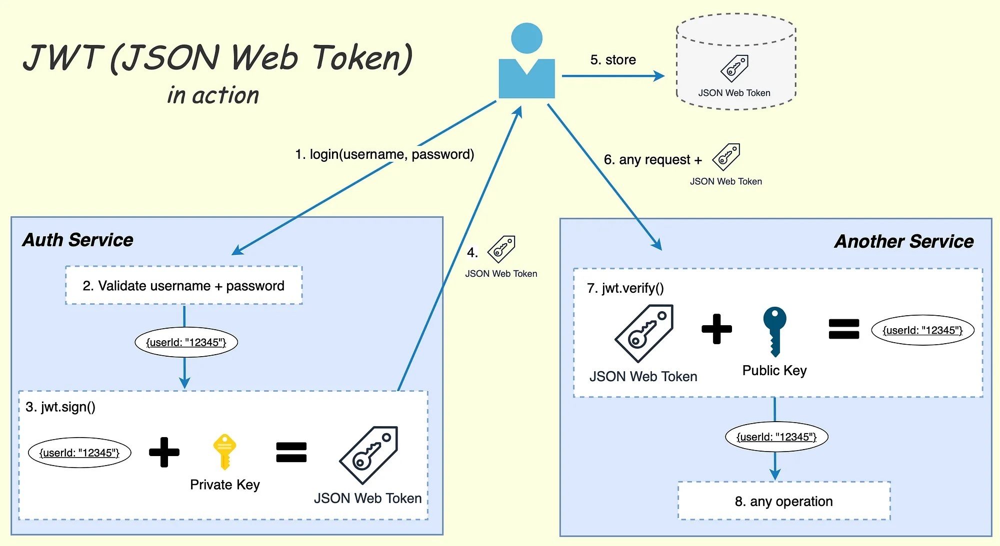
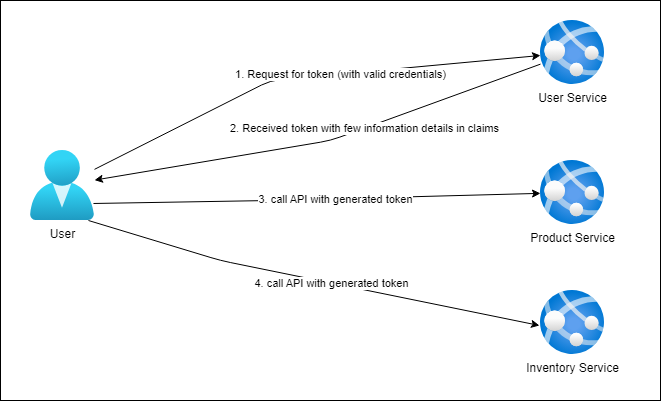

## How authentication worked
- First user/app will request for JWT token by passing correct credential to a service (called Auth service).
- Service will verify those data and generate a token with required information in claims.
- User/App will call another service API linked with the previous auth server with the generate token.
- another service will verify the JWT token and allow to access resources based on verification result.

\

### In this repo services are connectd like below

### Reference 
https://www.c-sharpcorner.com/article/jwt-token-creation-authentication-and-authorization-in-asp-net-core-6-0-with-po/ \
https://github.com/StefanescuEduard/JwtAuthentication/tree/master

### RSA key generator (online)
https://www.csfieldguide.org.nz/en/interactives/rsa-key-generator/ \
https://travistidwell.com/jsencrypt/demo/